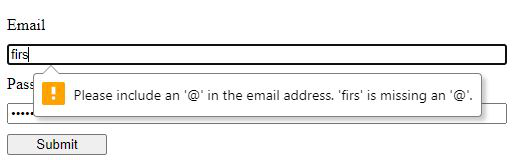
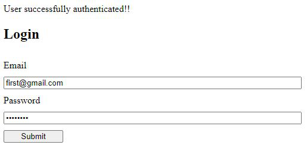
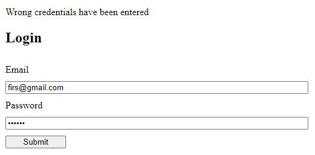
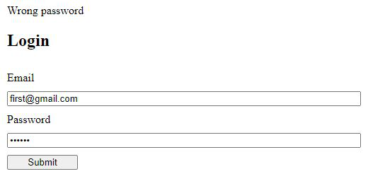

# Create a login form to learn all about how forms are handled in React.

We use authentication to verify user.
Firstly, in Email field, input must be in email format. Otherwise, error is popped by browser:

Successful login

Wrong email

Wrong password

